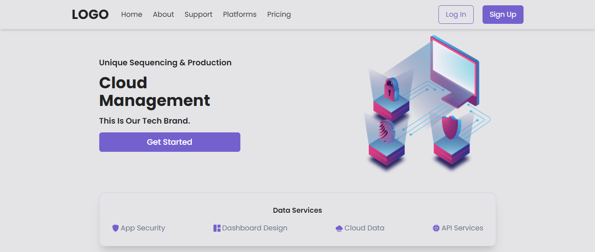

  
  <h1>React Cloud App <a href="https://mbcloud.netlify.app/">(watch online)</a></h1>
  

    A Cloud app with ReactJs and TailwindCss. The main purpose of creating this app was using TailwindCss. In the app you can smooth scroll to the different pages.
  

  

    I got the inspiration for this project from <a href="https://www.youtube.com/channel/UCmT9TwcIb_yAe7-Uqhn3fBA">Code Commerce</a>
  

  

    Edit the codes and let me know if you have more knowledge or better ideas.
  

  
In the project directory, you can run:

  <pre>npm start</pre>
  

    It runs the app in the development mode. Open
    <a href="http://localhost:3000">http://localhost:3000</a> to view it in the
    browser.
  

  

    The page will reload if you make edits. You will also see any lint errors in
    the console.
  

